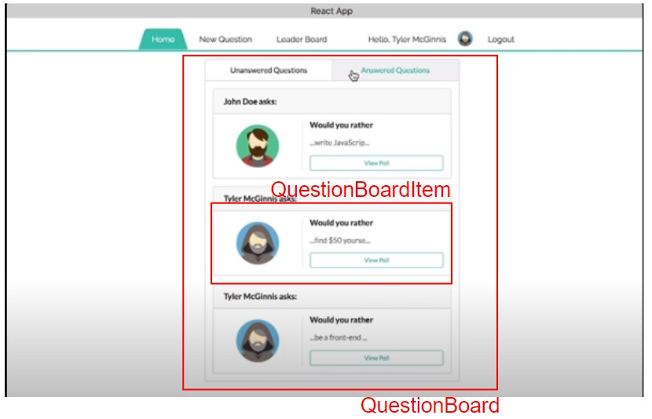

# Would you rather APP

Sample project to show the React/Redux fundamentals:

- React/Redux integration
- Middleware
- Router
- Redux think for async calls

This project was implemented using [Material UI](https://material-ui.com/). 

Note from the **author**: I'm not an expert on HTML and CSS then inside this code there are several choices made to have an UI but not design to mobile nor have a reactive behavior.

## Application
A simple web-based game of ["Would you rather"](https://en.wikipedia.org/wiki/Would_you_rather).
- Answer questions
- Create questions
- See Statistics (once question is answered)
- Multi-users (fix users)

## Installing

To get started developing right away:

* Install all project dependencies with `npm install`
* Start the development server with `npm start`

## Project organization
```
Index
    |__src
        |__Components
        |__Middleware  
        |__Reducers
        |__utils
        index.js
```
## Screens
The following screens shown the React components and paths
|              |   |
:-------------------------:|:-------------------------:
 |    
 |  
 |  

